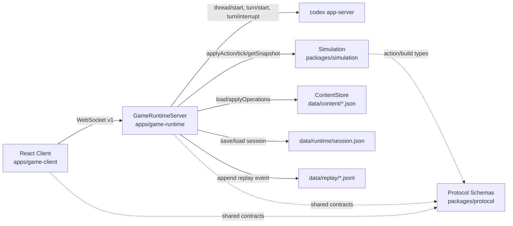
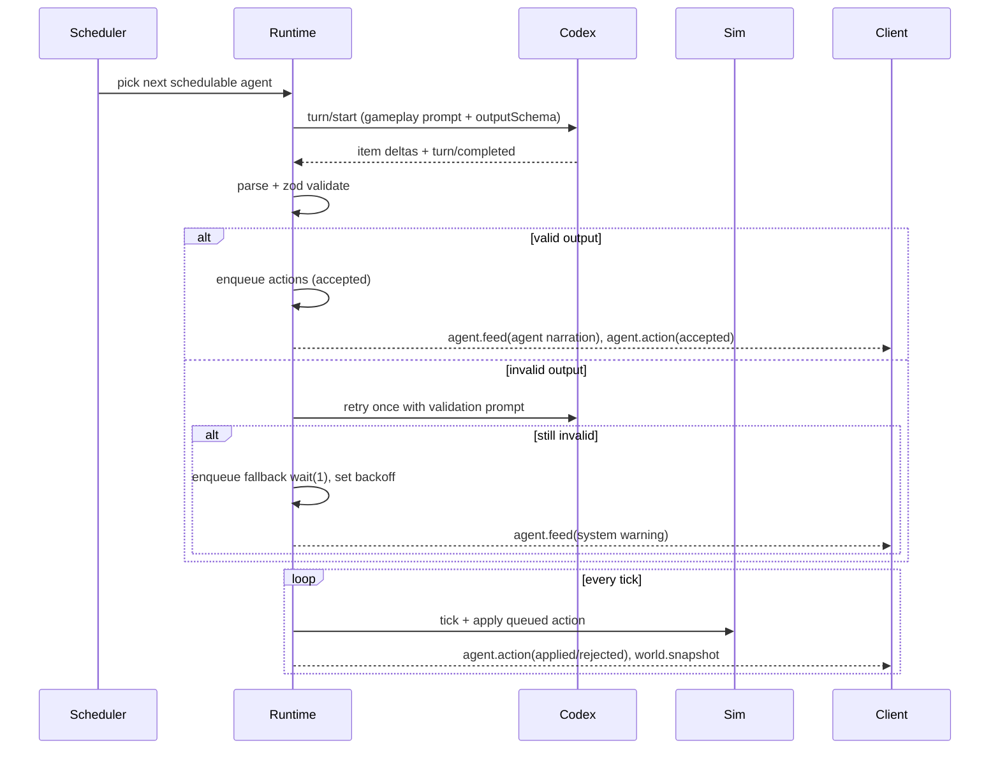

# CodexGame 架构与流程深度分析

## 1. 直接结论

`CodexGame` 的核心是一个“**协议强约束 + 确定性模拟 + 运行时编排 + 展示层解耦**”的多 Agent 沙盒系统：

- **协议层（`packages/protocol`）**定义了唯一消息契约与动作/构建 schema；
- **模拟层（`packages/simulation`）**掌握世界状态转移权威，保证同 seed + 同动作流的确定性；
- **运行时层（`apps/game-runtime`）**负责 Codex turn 调度、动作排队执行、构建内容写入、错误降级、重连与持久化；
- **客户端层（`apps/game-client`）**只做视图与控制台，不掌握游戏真相状态。

从代码结构和流程看，这是一个明确遵守“runtime authority, client presentation-only”的项目。

## 2. 项目目标与设计取向

从 `README.md` 与代码实现可归纳出三个设计取向：

1. **自驱多 Agent 世界演进**
   - 每个 agent 有独立 gameplay thread（`thread/start`）；
   - runtime 轮询调度 agent，持续请求下一回合动作。

2. **严格结构化输出，拒绝自由格式**
   - gameplay 输出强制 `AgentTurnOutput`；
   - build 输出强制 `BuildOutput`；
   - runtime 对无效输出执行重试 + 回退动作。

3. **可恢复、可回放、可审计**
   - 定期保存 session 快照；
   - JSONL replay 记录全流程事件；
   - 内容变更采用原子写（tmp + rename）。

## 3. 分层架构总览

### 3.1 协议层职责（`packages/protocol`）

- `src/messages.ts`
  - 定义 `PROTOCOL_VERSION = "v1"`；
  - 定义 Client/Server message envelope；
  - `parseClientMessage` 负责入站校验；
  - `encodeServerMessage` 负责出站序列化。
- `src/actions.ts`
  - 定义 11 类 Agent 动作（move/interact/gather/attack/craft/place/wait/talk/set_relation/inspect_agent/loot_agent）；
  - `agentTurnOutputSchema` 约束 narration + 1~4 actions；
  - 导出 `agentTurnOutputJsonSchema` 供 turn/start outputSchema。
- `src/build.ts`
  - 定义 content operation（upsert/remove）；
  - `buildOutputSchema` 约束 builder 输出；
  - 导出 `buildOutputJsonSchema` 供 builder turn。

### 3.2 模拟层职责（`packages/simulation`）

- 世界生成：`src/world.ts`
- 状态机与动作执行：`src/simulation.ts`
- 快照与提示上下文：`src/snapshot.ts`
- 类型定义：`src/types.ts`

### 3.3 运行时职责（`apps/game-runtime`）

- `GameRuntimeServer.ts`：会话生命周期、tick/scheduler、Codex turn orchestration、WS 广播；
- `CodexAppServerClient.ts`：stdio JSON-RPC 传输；
- `contentStore.ts`：内容读写与构建应用；
- `stateStore.ts` / `replay.ts` / `metrics.ts`：持久化、回放、指标；
- `prompting.ts`：gameplay/build/retry prompt 生成。

### 3.4 客户端职责（`apps/game-client`）

- `App.tsx`：WS 生命周期、协议分发、状态组装；
- `game/IsometricScene.ts`：Phaser 渲染与相机交互；
- `components/GodConsoleSidebar.tsx`：God 控制台、build 请求、session 控制。

## 4. 协议与数据契约

### 4.1 Client -> Runtime

`session.start` / `session.reset` / `god.send` / `build.request` / `agent.pause` / `agent.resume`

关键点：

- `session.start` 必须给出 `agents`（1~4）；
- `session.start.agents[*].personaPrompt` 为可选字段（`trim` 后 1~500 字符），仅作用于 gameplay prompt 的角色约束追加段；
- `god.send` 支持广播和定向目标 agent；
- `session.reset` 支持预设下一局 seed。

### 4.2 Runtime -> Client

`session.state` / `world.snapshot` / `agent.turn` / `agent.action` / `agent.feed` / `build.result` / `error`

关键点：

- `world.snapshot` 同时下发地图、实体、agents、catalog；
- `agent.action` 区分 `accepted`（入队）与 `applied/rejected`（执行结果）；
- `agent.feed` 承载 `god/agent/system/reasoning` 四类文本流。

### 4.3 Schema 约束的架构意义

runtime 在 `turn/start` 明确传入 output schema：

- gameplay: `agentTurnOutputJsonSchema`
- builder: `buildOutputJsonSchema`

这让“LLM 输出自由文本”变成“运行时可验证的数据结构”，是稳定性与可维护性的关键基座。

## 5. Simulation（游戏状态机）深度解析

### 5.1 世界生成与确定性来源

`createInitialState`（`world.ts`）流程：

1. 基于 `fractalNoise + valueNoise` 生成地形（water/mountain/forest/plains）；
2. 做 terrain smoothing（降低随机噪点）；
3. 按螺旋策略为 agents 选出生点（避水、保持最小间距）；
4. 按 `biomeRules/spawnRules` 生成资源与生物；
5. 初始化 agent 关系为两两 `neutral`。

确定性的核心机制：

- 所有“随机”都来源于 seed 驱动的哈希函数（`hashUnit/hashString`）；
- 无外部时钟扰动 world 生成；
- 同 seed + 同 content + 同 agent config 生成同初始状态。

### 5.2 动作执行模型（`Simulation.applyAction`）

动作执行是单点入口，覆盖：

- 位移与阻挡判定（`isBlocked`）；
- 资源采集与耗尽删除；
- 战斗（PVE + PVP）；
- 制造与放置；
- 社交（talk / set_relation / inspect_agent / loot_agent）；
- 等待恢复 stamina。

每个动作分支都会返回标准 `ActionResult`，并在关键路径更新 score/scoreTrack。

### 5.3 Tick 模型与生物 AI

`Simulation.tick`：

1. `state.tick += 1`；
2. 递减 agent cooldown；
3. 调用 `tickCreatureAi`；
4. 重算评分。

`tickCreatureAi` 特点：

- hostile creature 在 aggro grace 期后激活追击；
- move/attack 都按 creature id 派生的 phase 周期触发；
- 单 tick 限制攻击者数量，避免瞬时集火爆发；
- `behaviorState` 在 `idle/chase/attack` 间切换并进入 snapshot。

### 5.4 评分系统是玩法驱动器

评分在 `recomputeAgentScores` 中按权重：

- survival: `0.5`
- progression: `0.25`
- social: `0.25`

这意味着项目不是单纯生存或战斗游戏，而是“生存 + 发展 + 社会关系协作/对抗”的复合目标系统。  
从 prompt 与动作集合看，`social` 维度是本项目差异化核心之一。

## 6. Runtime（编排层）深度解析

### 6.1 启动与恢复

`GameRuntimeServer.start()` 主流程：

1. 加载内容 `contentStore.load()`；
2. 初始化 runtime/replay 目录；
3. `restoreSession()` 尝试恢复历史快照；
4. 启动 tick/scheduler/persist 定时器；
5. 异步预热 model catalog（并在恢复场景下补建 threads）。

### 6.2 Session 生命周期

`startSession`：

- 校验 1~4 唯一 agent；
- 构建 Simulation；
- 确保 codex 已连接；
- 为每个 agent 建 gameplay thread，为 builder 建独立 thread；
- phase 切到 `running` 并广播 snapshot。

`resetSession`：

- 中断 active turn，清空 pending turn；
- 清理 simulation/thread/队列状态；
- 生成并保存 `preparedSeed`；
- 清除持久化 session 文件。

### 6.3 调度与执行解耦（关键架构）

runtime 把“决策请求”和“动作执行”分成两条节奏：

- `scheduler`（默认 350ms）：决定何时向某 agent 请求下一 turn；
- `tick`（默认 200ms）：从队列取动作并调用 simulation 执行。

这使系统具备：

- 对 LLM latency 的弹性缓冲（action queue）；
- 对 agent 公平轮询（`schedulerIndex`）；
- 对异常输出降级与背压（invalid streak + backoff）。

### 6.4 Gameplay turn pipeline

### 6.5 Builder pipeline（内容演进）

`runBuildRequest(goal)`：

1. 用当前 content + goal 生成 builder prompt；
2. 调用 builder thread `turn/start`（schema 受 `buildOutputJsonSchema` 约束）；
3. `contentStore.parseBuildOutput` 校验/归一化；
4. `applyOperations` 原子写三份 content 文件；
5. 将新 content 注入 simulation（`simulation.setContent`）；
6. 广播系统 feed + 返回 `build.result`。

这条链路本质上实现了“游戏规则在线可演进”，且保持了严格边界：只改内容，不改代码。

### 6.6 错误、超时、重连与熔断

- turn timeout: `45s`，超时自动 `turn/interrupt`；
- active turn 可被 `god.send` / pause / reset 中断；
- app-server 断连触发指数退避重连；
- 超过 `maxReconnectAttempts=5` 进入 circuit breaker（phase=`error`）。

这是一套完整的“可继续运行优先”策略，而不是出错即崩。

### 6.7 持久化与回放

- `StateStore`：`data/runtime/session.json`（原子写）；
- `ReplayLogger`：`data/replay/*.jsonl`；
- `persistSession` 周期落盘 simulation + metrics + threadIds。

工程价值：

- 支持故障后恢复；
- 支持回归问题时间线定位；
- 支持对 agent 行为进行离线复盘。

## 7. Client（展示与控制）深度解析

### 7.1 App.tsx 是“协议适配器”

`App.tsx` 用单一 `switch(message.type)` 吸收所有 runtime 事件：

- `session.state` -> phase/threads/runtime meta
- `world.snapshot` -> HUD state + `IsometricScene.setSnapshot`
- `agent.feed` -> feed
- `agent.action` -> 非 accepted 事件文本化
- `agent.turn` -> latency
- `build.result` / `error` -> system feed

这让 UI 不直接理解 runtime 内部复杂性，只消费稳定协议。

### 7.2 IsometricScene 的边界清晰

`IsometricScene` 仅接收 `IsoSnapshot`，内部完成：

- terrain/entity/placement/actor 四类 render 同步；
- camera 跟随 + 键盘平移 + 滚轮缩放；
- actor 点击回传 `onAgentSelect`。

它不直接发网络请求，不持有业务状态权威。

### 7.3 GodConsoleSidebar 的职责

- session 启动前：配置 agents/model/effort；
- session 运行中：选择观察 agent、发送 God 指令、提交 build goal；
- 将 feed 以 owner 分组展示（agent/god/system）。

## 8. 端到端关键流程

### 8.1 会话启动

1. Client 发送 `session.start`
2. Runtime 初始化 simulation + 启动 threads
3. Runtime 广播 `session.state(running)` 与 `world.snapshot`
4. Scheduler 开始轮询触发 gameplay turn

### 8.2 God 干预

1. Client 发送 `god.send`
2. Runtime 将消息入 `godQueueByAgent`，标记 `godPriorityPending`
3. 必要时中断当前 turn
4. 下个 turn prompt 注入 God 指令，agent narration 必须先响应 God

### 8.3 Build 内容更新

1. Client 发送 `build.request`
2. Runtime 走 builder turn，解析为 operations
3. ContentStore 原子写入 `prefabs/recipes/world_rules`
4. Simulation 热更新 content
5. Client 收到 `build.result` 与后续 world 变化

## 9. 这个游戏的“核心”到底是什么

从机制组合来看，本项目核心不是“手操角色”，而是：

**在确定性沙盒中，多个 LLM Agent 通过受约束动作进行生存-发展-社交博弈，God 负责高层策略干预，Builder 负责规则内容演进。**

可拆成三个闭环：

1. **Agent 决策闭环**：`world snapshot -> prompt -> schema actions -> simulation apply`
2. **世界演进闭环**：`tick + creature ai + queue actions -> new snapshot`
3. **规则演进闭环**：`build goal -> content operations -> atomic write -> simulation content refresh`

其中最独特的是第 3 条：它让“玩法规则”本身可被在线编辑，而不是编译期固化。

## 10. 测试覆盖与可信度评估

当前测试覆盖了关键支柱：

- 协议合法性：`packages/protocol/test/*`
- 确定性：`packages/simulation/test/simulation_determinism.test.ts`
- 世界生成质量：`world_generation.test.ts`
- 战斗/AI/社交/评分：`combat_ai.test.ts`、`social_actions.test.ts`、`scoring.test.ts`
- 恢复语义：`simulation_restore.test.ts`
- Runtime 内容安全：`apps/game-runtime/test/contentStore.test.ts`
- UI 合约回归：`apps/game-runtime/test/ui-contract.integration.test.ts`

这批测试覆盖“契约正确性 + 状态转移稳定性”的主脉络，工程上是够用的基础盘。

## 11. 主要优势与潜在风险

### 11.1 优势

- 分层边界清晰，权责明确；
- schema-first 约束强化了 LLM 集成可控性；
- deterministic simulation 便于回归与重放；
- runtime 具备重连、回退、熔断等工程防线；
- content 原子写保证构建变更一致性。

### 11.2 风险与改进点

1. **配置文档漂移**
   - `runtimeConfig.schedulerMs` 默认值代码为 `350`，部分文档语义可能仍按 `500` 记忆；
   - 建议统一以代码常量或单源配置文档生成。

2. **指标可见性不足**
   - `MetricsTracker` 已统计 turns/invalid/applied/rejected/queue；
   - 但客户端当前主要看到的是配置项，不是实时 metrics 快照；
   - 可考虑在 `session.state` 增量暴露 metrics。

3. **断线与重连场景测试仍偏薄**
   - 代码有重连逻辑与 circuit breaker；
   - 但缺故障注入式 integration test，真实稳定性依赖运行时环境。

## 12. 演进建议（按影响面排序）

1. **先补观测性**
   - 将 runtime metrics 显式下发给 client；
   - 增加 replay 索引（按 turnId/agentId 检索）。

2. **再补可靠性测试**
   - 增加 reconnect fault-injection integration test；
   - 增加“invalid output 连续爆发”端到端用例。

3. **最后扩展玩法**
   - 新动作/新内容操作必须遵守：
     - 先改 `packages/protocol`
     - 再改 `packages/simulation`
     - 再改 runtime wiring + client handling
     - 最后补测试。

---

## 附录：关键入口与文件索引

- Runtime 启动入口：`apps/game-runtime/src/index.ts`
- Runtime 主循环：`apps/game-runtime/src/runtime/GameRuntimeServer.ts`
- Codex RPC 传输：`apps/game-runtime/src/codex/CodexAppServerClient.ts`
- 协议消息：`packages/protocol/src/messages.ts`
- 动作 schema：`packages/protocol/src/actions.ts`
- 构建 schema：`packages/protocol/src/build.ts`
- 模拟器：`packages/simulation/src/simulation.ts`
- 世界生成：`packages/simulation/src/world.ts`
- 快照与 prompt context：`packages/simulation/src/snapshot.ts`
- 客户端主适配层：`apps/game-client/src/App.tsx`
- 客户端渲染层：`apps/game-client/src/game/IsometricScene.ts`
- God 控制台：`apps/game-client/src/components/GodConsoleSidebar.tsx`
